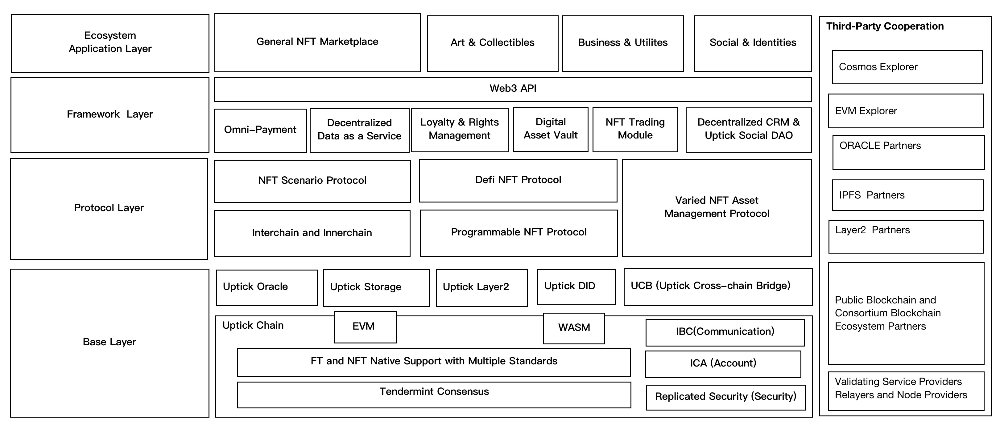
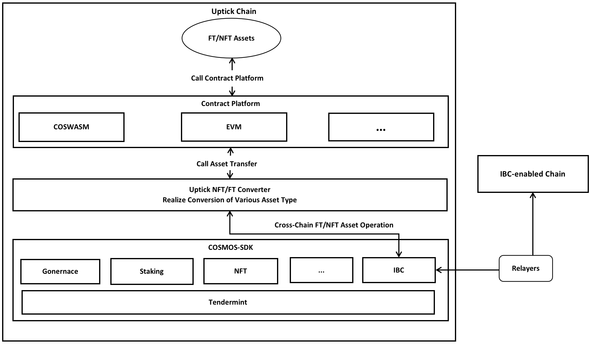
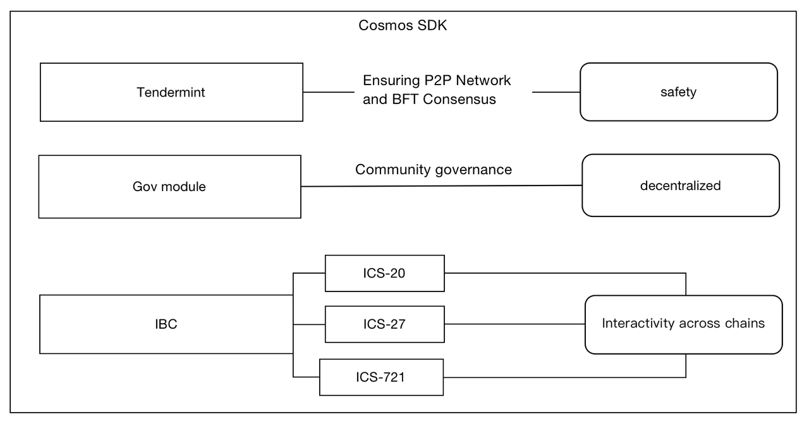
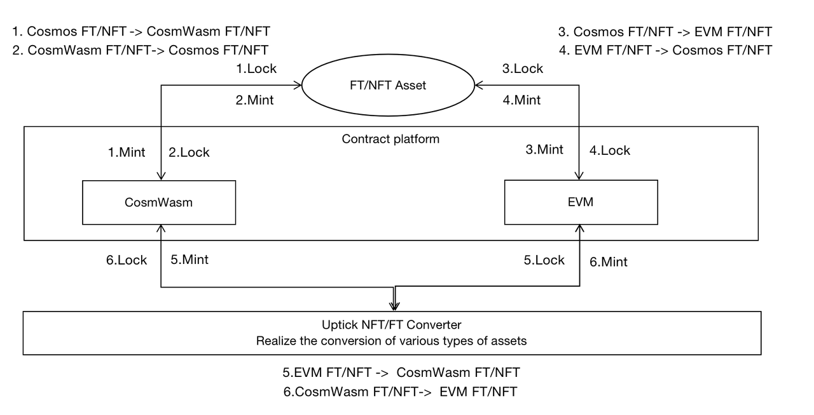
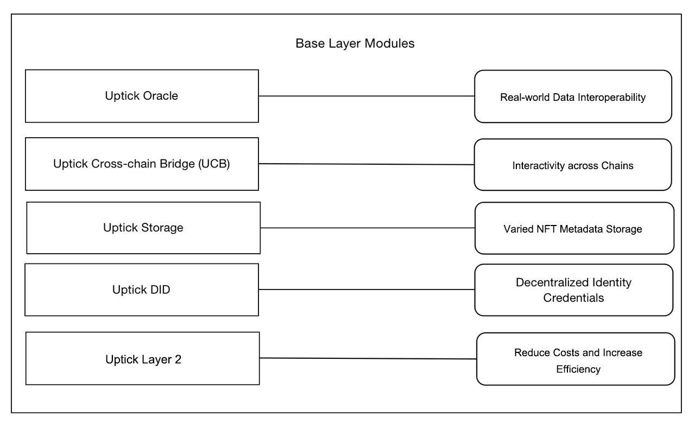
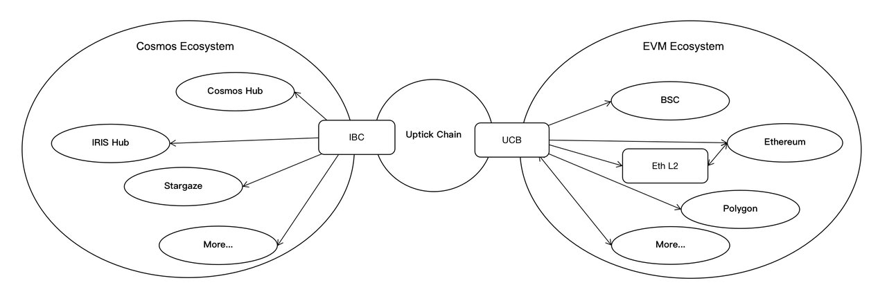
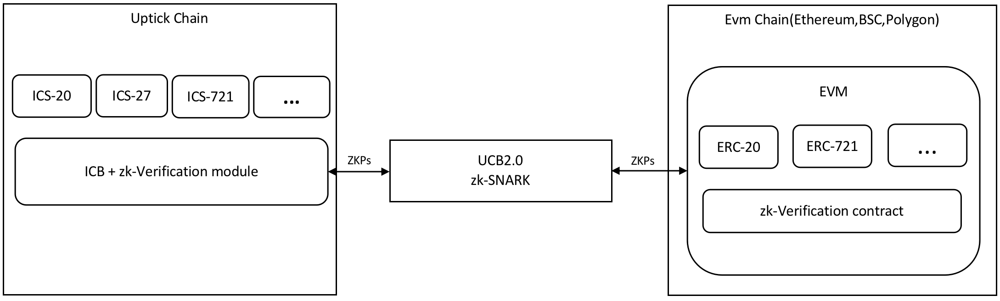
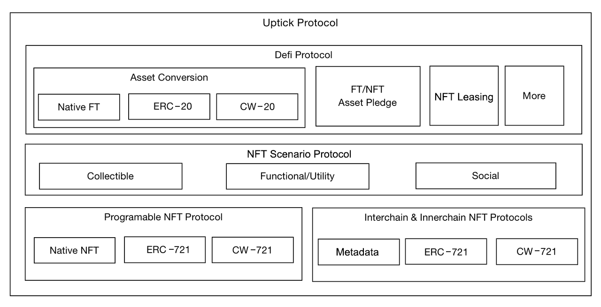
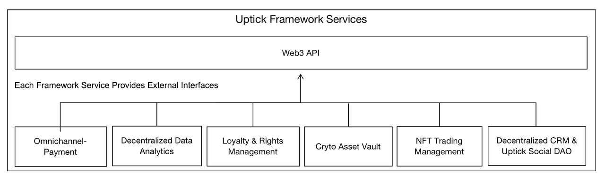

# Uptick Network 技術白皮書

- [Uptick Network 技術白皮書](#uptick-network-技術白皮書)
- [摘要](#摘要)
  - [1. 概述](#1-概述)
  - [2. 系統架構](#2-系統架構)
  - [3. Uptick 鏈](#3-uptick-鏈)
    - [3.1. 基於 Cosmos-SDK 建置](#31-基於-cosmos-sdk-建置)
   - [3.2. 主流智能合約語言支援](#32-主流智能合約語言支援)
  - [4. 基礎層模組](#4-基礎層模組)
    - [4.1. 預言機](#41-預言機)
    - [4.2. Uptick 跨鏈橋（UCB）](#42-uptick-跨鏈橋ucb)
    - [4.3. Uptick 儲存](#43-uptick-儲存)
    - [4.4. Uptick 去中心化身分認同（DID）](#44-uptick-去中心化身分認同did)
    - [4.5. Uptick 二層網路（Layer 2）](#45-uptick-二層網路layer-2)
  - [5. Uptick 協定](#5-uptick-協定)
    - [5.1. 可程式 NFT 協定](#51-可程式-nft-協定)
    - [5.2. 跨鏈 NFT 協定](#52-跨鏈-nft-協定)
    - [5.3. 鏈內 NFT 協定](#53-鏈內-nft-協定)
    - [5.4. NFT 場景化協議](#54-nft-場景化協議)
    - [5.5. 去中心化金融（DeFi）協議](#55-去中心化金融defi-協議)
  - [6. 框架與服務](#6-框架與服務)
    - [6.1. 全通路支付模組](#61-全通路支付模組)
    - [6.2. 去中心化資料分析服務](#62-去中心化資料分析服務)
    - [6.3. 積分與權益管理](#63-積分與權益管理)
    - [6.4. 去中心化顧客關係管理（CRM）服務與 Uptick 社交 DAO](#64-去中心化顧客關係管理crm服務與-uptick-社交-dao)
    - [6.5. Web3 API](#65-web3-api)
   - [7. 現實世界資產代幣化（RWAs）](#7-現實世界資產代幣化rwas)
   - [8. 發展方向與路線圖](#8-發展方向與路線圖)
   - [9. 結論](#9-結論)
 - [10. 參考文獻](#10-參考文獻)

 

## 摘要
Uptick Network 是一套全面的、企業級的數位資產基礎設施及生態系統，建構於 Uptick 鏈之上——這是一條基於 Cosmos-SDK 開發的高性能區塊鏈。其目標是透過提供模組化、可擴展的基礎設施，支援各類基於 NFT 的應用及商業場景落地。

Uptick Network 的核心元件包括：
- **跨鏈通訊協定（IBC）**：實現不同區塊鏈間的無縫互通
- **Uptick 跨鏈橋（UCB）**：確保不同區塊鏈間資產順暢轉移的跨鏈橋
- **星際檔案系統（IPFS）**：用於元資料儲存的安全分散式儲存方案
- **去中心化身分（DID）**：去中心化身分管理體系
- **預言機（Oracle）**：連結區塊鏈與現實世界資料的去中心化預言機網絡
- **二層網路解決方案（Layer 2）**：提升網路可擴充性並降低交易成本

Uptick Network 還整合了以太坊虛擬機（EVM）模組及 WebAssembly（WASM）支持，可相容於各類智慧合約與去中心化應用程式（dApp）。

此外，此網路具備模組化的 Uptick 協定與服務模組，以及一套專為支援各類 NFT 商業場景設計的開發框架，同時打造了旗艦級 NFT 交易市場作為生態內的核心應用。

Uptick Network 的開發與拓展，由核心團隊主導，並透過社群治理與 DAO 機制，讓全球社群與產業合作夥伴共同推動。

### 1. 概述
隨著區塊鏈等 Web3 技術的持續發展與完善，傳統 Web2 應用正逐步轉型為 Web3 。 NFT 技術作為 Web3 領域數位資產的重要載體，已成為業界關注的焦點。市場期待 NFT 商業應用實現突破與落地，認為這將是觸發下一輪市場週期的關鍵因素之一。我們對此深信不疑，並致力於將以 NFT 為代表的各類數位資產應用場景及代幣經濟模型有效融入公鏈體系。

我們的目標是打造一個可持續發展的 Web3 生態系統，讓功能型代幣在推動虛擬與實體經濟發展中切實發揮作用，避免單純的金融投機，並倡導長期價值導向。

先前，NFT 應用的研發重心集中在創意層面、底層區塊鏈及二層網路技術層面，導致大量 NFT 應用缺乏永續發展能力。核心問題在於，目前缺乏能夠為 NFT 提供真正企業級支援的基礎設施平台，這使得 NFT 在商業領域的落地進程緩慢，Web2 向 Web3 轉型的企業級應用也陷入停滯。

商業應用面臨的普遍問題包括：運作穩定性不足、效率與安全性難以兼顧、開發及營運成本高、跨域資產權益與原子性缺乏保障，以及商業中間件模組嚴重短缺。

Uptick Network 核心技術團隊歷經從 Web1 到 Web3 的完整發展週期，在企業級基礎設施及應用的研發、營運方面擁有豐富經驗。我們打造 Uptick Network，為 NFT 相關商業應用提供技術支援、一站式解決方案及生態發展平台，建構以企業級 NFT 基礎設施與服務為基礎的 Web3 生態應用系統。

#### 核心理念
我們堅信，任何資產──無論是加密原生資產或是映射自現實世界的資產──都需要唯一的發行與權屬確認機制。 NFT 是所有數位資產的技術載體，基於 NFT 的數位資產需具備原子性與標準化特性，能夠在不同區塊鏈經濟體系間自由、無損流轉，同時具備完整的可追溯性、跨應用及跨鏈互通性，以此保障加密數位資產作為私有財產的可持續價值。

*本白皮書不僅闡述 Uptick Network 的整體架構與模組化組成，還會在部分模組中補充基礎知識點，幫助讀者透過單份文件全面理解相關內容。 *

### 2. 系統架構
Uptick Network 的技術架構採用多層級、模組化的區塊鏈基礎架構設計，各層級具備橫向擴展能力與模組化封裝特性。

#### 四大核心層級
1. **基礎圖層（Base Layer）**
2. **協定層（Protocol Layer）**
3. **框架層（Framework Layer）**
4. **生態應用層（Ecosystem Application Layer）**

**基礎層** 包含基於 Cosmos-SDK 開發的原生 Uptick 鏈，預設具備 IBC 跨鏈能力，解決了 Cosmos 技術體系內同構鏈之間的跨鏈協定能力問題。此外，Uptick Network 研發了異構鏈間的跨鏈橋（UCB），實現 NFT 資產在同構鏈與異構鏈間的自由轉移與互通。

Uptick Network 整合了預言機、IPFS、DID 等基礎元件，形成了穩固的底層基礎設施層。

在這些元件之上，Uptick 協定根據商業模式進行抽象封裝，構成**協定層**。此層級封裝了以 NFT 為載體的各類數位資產元資料標準，以及本地鍊和跨鏈場景下 NFT 操作的去中心化協定、商業邏輯、經濟模型與治理規則，同時也預置了用於進一步擴容的二層網路解決方案。協定層採用模組化封裝，具備開放的可擴充性。

**框架層** 提供商業級 NFT 資產的支援服務，基於標準協議構建了多鏈資料分析、全通路支付、版權與版稅管理、數位資產錢包管理、數位資產交易管理、去中心化資料服務、去中心化治理服務等模組。開發者可透過框架層及 Web3 API，快速、方便地開發去中心化的企業級 NFT 應用程式（dApp）。

**生態應用層** 是開放的生態應用體系，既包含 Uptick Network 團隊打造的通用 NFT 交易平台，以及依託多年行業經驗構建的各類應用，更重要的是，它將匯聚全球商業應用開發者與運營商打造的生態應用。我們相信，高品質的 NFT 基礎設施平台與有效的激勵機制，將吸引大量優質商業應用在 Uptick Network 落地。

圖 1. Uptick Network 技術架構

### 3. Uptick 鏈

圖 2. Uptick 鏈核心元件

Uptick 鍊是基於 Cosmos-SDK 建構的 NFT 生態應用鏈，為各類 NFT 應用情境（包括跨鏈 NFT 資產支援）提供全面的底層支援。它整合了 Cosmos 生態的 IBC 跨鏈特性，且完全相容於主流 EVM 體系，能夠為 NFT 應用提供豐富的擴展底層支撐。

Uptick 鏈支援基於跨鏈協定 ICS-721 的 EVM 合約跨鏈轉移功能。

#### 3.1. 基於 Cosmos-SDK 構建

圖 3. Cosmos SDK 在 Uptick 鏈中的作用

在 Cosmos 生態中，開發者可藉助 Cosmos-SDK 建立客製化區塊鏈應用，實現高可客製化、模組化、安全且高效能的去中心化應用開發。

##### Cosmos 生態核心特性：
- **跨鏈互通性**：Cosmos 透過跨鏈通訊協定（IBC）支援不同區塊鏈間的資產與資料轉移，使基於 Cosmos 的區塊鏈可與其他支援 IBC 標準的鏈互通，實現同質化代幣（FT）、非同質化代幣（NFT）等資料類型的跨鏈流轉。
- **模組化**：Cosmos-SDK 提供一系列預置功能模組（如治理、質押、代幣管理、跨鏈通訊等），開發者可根據業務需求組合、客製化這些模組，建立符合特定場景的區塊鏈應用。
- **可擴展性**：Cosmos 生態採用分層架構設計，具備高可擴展性。不同區塊鏈可在生態內獨立運作、不干擾，減少網路擁塞問題，提升整體效能。
- **高安全性**：Cosmos-SDK 採用基於拜占庭容錯（BFT）的 Tendermint 共識演算法，確保區塊鏈應用的安全與穩定；同時提供基於角色的存取控制、多簽等安全特性，保護用戶資產與資料安全。
- **開源且社群驅動**：Cosmos 是開源的社群主導型項目，原始碼與文件均託管於 GitHub。開發者與社群成員可積極參與專案開發維護，推動整個 Cosmos 生態的發展與創新。

##### Uptick Network 選擇 Cosmos 的核心原因：
- 透過 Tendermint 共識，實現 P2P 網路底層與 BFT 共識的高安全性和穩定性；
- 透過 Cosmos 提供的 IBC 協議，實現 Cosmos 生態內或支援 IBC 標準的網路中 FT/NFT 資產的跨鏈轉移：
 - 基於 ICS-20 標準的 FT 跨鏈轉移協議：支援 Cosmos 生態內多鏈 FT 跨鏈至 Uptick 鏈，以及 FT 資產轉換為 EVM 體系的 ERC20 代幣；透過 UCB 等基礎模組，可跨鏈至以太坊、幣安智能鏈、Polygon 等 EVM 生態；
 - 基於 ICS-27 的跨鏈帳戶管理協定：優化跨鏈互動體驗，使用者無需感知跨鏈流程，僅需維護單一操作介面；
 - 基於 ICS-721 標準的 NFT 跨鏈轉移協議：實現 IBC 互聯區塊鏈（包括同構鏈與異構鏈）間的 NFT 互操作；儘管 IBC-NFT 跨鏈仍處於基礎設施建設初期，商業場景尚未充分挖掘，但 Uptick Network 將率先跨鏈 NFT 基礎設施，成為首批落地應用佈局的公鏈之一；
 - 利用 Cosmos-SDK 中的 Gov 模組及配套經濟模型，實現 DAO 功能。

##### SDK 功能增強
除使用原生 Cosmos-SDK 外，Uptick Network 核心團隊基於業務需求和對 SDK 的深度理解，積極參與 SDK 的最佳化迭代，為社群做出貢獻。結合現有 SDK，我們計劃在以下方向進行最佳化：
- 最佳化資料儲存模組，降低鏈運作所需的磁碟空間佔用；
- 研發鏈內 NFT 轉移協議，並作為開源擴展 SDK 貢獻給 Cosmos 社群（具體 NFT 鏈內轉換規則詳見 5.3 可程式 NFT 協議）；
- 擴充 SDK 功能，使其可在鏈內呼叫外部生態服務（如 Chainlink VRF 隨機數功能）。

#### 3.2. 主流智能合約語言支持
智能合約是運行在去中心化區塊鏈上的高確定性、不可篡改、高可靠的數位協議。由於 NFT 最初是基於 ERC 協議構建，目前主流 NFT 平台均支援智能合約。 Uptick 鏈同樣支援主流智慧合約體系，現階段已相容於 EVM 和 Wasm 智慧合約，並將根據應用的商業需求，在未來支援更多類型的智慧合約。

此外，傳統 NFT 平台僅支援 EVM 或 WASM 體系的 NFT 資產，但兩類資產各有適用場景，且有相互轉換的商業需求。

因此，Uptick 鏈不僅支援主流的 EVM 和 WASM 合約，還在合約層實現了兩類資產的無縫轉換。

圖 4. Uptick NFT/NT 轉換機制

##### 此設計的核心優勢：
- **充分發揮各類合約優勢**：基於 EVM 的合約開發者生態更龐大，超 90% 的 NFT 資產基於 ERC 協議構建，且 EVM 的安全性已通過大量應用驗證，因此金融級 NFT 交易通常採用 EVM 智能合約；而基於 WASM 的合約開發應用）。
- **基於業務需求與場景的雙向轉換**：Uptick 在底層實現了合約的雙向轉換能力，支援鏈層級的合約轉換。例如，若需將 EVM 合約或其中部分 NFT 資產轉換為 WASM 合約類型資產，Uptick 底層合約轉換器可實現 NFT 資產的無縫轉換。

要注意的是，區塊鏈合約底層技術處於持續迭代中，因此我們將不斷更新 Uptick 合約引擎，相容於最新的合約開發語言。

### 4. 基礎層模組

圖 5. 基礎層模組

Uptick Network 在 Uptick 鏈上層建構了一套完整的基礎模組體系，並透過長期實踐持續優化完善。

#### 4.1. 預言機
預言機是連接區塊鏈與現實世界資料集的去中心化網絡，是不可或缺的基礎設施。 Uptick 交易市場及其他生態應用可藉助 Chainlink VRF 實現由隨機數驅動的遊戲化場景（如去中心化彩票功能）。

Uptick 鏈主網上線後，我們計劃在鏈上部署預言機節點，深度整合預言機服務，提供以下核心能力：
- **去中心化金融（DeFi）**：提供精準的價格參考資料來源；
- **企業級應用**：作為區塊鏈與現實世界互動的抽象層；
- **網路基礎設施服務**：以去中心化預言機網路形態運作；
- **NFT 與遊戲**：提供 dApp 使用者可驗證公平、動態的遊戲體驗；
- **氣候數據市場**：為高度整合、互通且高效的氣候市場提供企業級中間件。

透過上述能力，Uptick 旨在為用戶提供更無縫、整合的區塊鏈體驗，同時藉助去中心化預言機網路保障數據的可靠性與準確性。

#### 4.2. Uptick 跨鏈橋（UCB）

圖 6. Uptick 跨鏈橋（UCB1.0）與 IBC 協同架構

在 Cosmos-SDK 中，Tendermint 輕客戶端採用扭曲愛德華曲線（Ed25519），與以太坊鏈使用的 BN254 曲線不相容，導致在以太坊鏈上驗證 Ed25519 簽章效率低、成本高。

為解決這個問題，Uptick Network 研發了 Uptick 跨鏈橋（UCB），主要針對基於 EVM 虛擬機器的區塊鏈間 NFT 跨鏈轉移場景。

目前，UCB 已實現 Polygon、以太坊、幣安智能鏈等主流鏈的 NFT 跨鏈功能，並將持續與更多區塊鏈系統建立資產互通機制。

與主要服務於 Cosmos 生態內跨鏈操作的 IBC 不同，UCB 聚焦於 Cosmos 生態外的跨鏈資產轉移與追蹤。

##### UCB 三階段迭代演進規劃
- **UCB V1.0**：基於對中繼節點的信任機制構建，存在中心化程度過高、信任假設薄弱、監管缺失等問題；若攻擊者控制大部分橋資金簽名節點，將引發安全風險。
- **UCB V2.0**：作為 UCB1.0 的升級版本，核心解決以下問題：
 1. 過度依賴中繼節點：UCB1.0 對中繼節點高度依賴，限制了跨鏈能力；UCB2.0 借助 IBC 跨鏈協議，實現 UCB 與 EVM 鏈間的跨鏈交易；
 2. 原生 IBC 輕客戶端資料計算與驗證Gas成本過高：UCB2.0 採用 zk-SNARK 演算法，將大量計算移至鏈下完成，鏈上僅驗證零知識證明（ZKPs），大幅降低資料驗證的 Gas 成本；
 3. 交易效率與成本優化：UCB2.0 引進 Rollup 機制，支援交易批次處理與驗證，降低交易手續費並提升吞吐量，打造更有效率、低成本的跨鏈解決方案。

圖 7. Uptick 跨鏈橋（UCB2.0）流程

#### 4.3. Uptick 存儲
Uptick Network 的儲存模組支援 IPFS 儲存方案－這是區塊鏈與 NFT 領域廣泛應用的分散式儲存方案。透過整合 IPFS，實現文件的去中心化儲存與訪問，提升區塊鏈應用的安全性、持久性與效率，Uptick Network 推薦將 IPFS 作為元資料儲存的最優方案。

為滿足生態應用的儲存效能需求，框架層將 IPFS 儲存的圖片快取至雲端儲存服務，實現更快的存取速度與更低的成本，且所有存取均透過 HTTPS 協定保障安全。

目前，Uptick Network 已部署自有 IPFS 節點，並與產業頭部儲存服務商合作，為 NFT 生態應用提供穩定、可靠、安全的去中心化儲存服務。

#### 4.4. Uptick 去中心化身分認同（DID）
去中心化身分（DID）是一種新型數位身分體系，依托區塊鏈與分散式帳本技術（DLT），為使用者提供自主掌控的數位身分管理方式，兼具安全性、隱私性與可靠性。

在區塊鏈生態中，DID 承擔以下核心功能：
- **去中心化**：不依賴中心化身分提供者，透過區塊鏈技術完成身分驗證，以去中心化特性提升安全與穩定性；
- **自主掌控**：使用者可完全掌控自身數位身份，無需依賴中心化第三方服務即可建立、更新、刪除身份資料；
- **隱私保護**：支援選擇性揭露功能，使用者可自主選擇向他人分享的個人訊息，保護隱私；同時，分散式儲存方式降低了個人資料外洩風險；
- **跨平台互通性**：遵循通用標準設計，可跨平台、跨應用使用，使用者無需為不同區塊鏈或分散式應用程式建立獨立身分；
- **可驗證憑證**：可與可驗證憑證結合，幫助使用者證明身分、資格或其他屬性，適用於服務存取、合約簽署、線上投票等場景。

簡言之，DID 在區塊鏈生態中的核心價值是為用戶提供去中心化、安全、可控的數位身分解決方案，既保護隱私，也提升跨平台互通性。

Uptick DID 是 Uptick Network 內基於 W3C 標準構建的去中心化身份憑證，解決了用戶去中心化身份管理及 NFT 資產權屬問題——尤其是跨鏈場景下，需通過去中心化身份認證驗證 NFT 資產所有權。

#### 4.5. Uptick 二層網路（Layer 2）
Uptick Layer 2 是建構在 Uptick 一層網路（Layer 1）之上的鏈下擴容方案，核心目標是透過優化交易速度、降低交易成本、提升可擴充性，增強一層區塊鏈的效能。基於二層網路建置的解決方案，可實現更高的吞吐量、更快的交易確認速度，以及更靈活的應用程式開發環境。

##### Uptick Layer 2 核心優勢：
- **降低手續費**：將多筆鏈下交易打包為單筆一層網路交易，減少資料負載；同時透過主網結算保障安全性與去中心化特性；
- **提升實用性**：結合高 TPS 與低手續費優勢，聚焦優化使用者體驗，拓展應用場景邊界。

隨著 Web3 領域新技術不斷湧現，Uptick Network 核心模組將持續更新，並新增更多基礎層模組。除核心團隊研發外，Uptick Network 也積極與技術社群團隊合作，持續改善並拓展基礎架構系統。

### 5. Uptick 協議
Uptick 協議是由 Uptick 核心團隊打造的模組化商業協議，核心目標是支援各類 NFT 商業場景。透過提供靈活、可適配的框架，Uptick 協議允許開發者創建並落地多樣化的 NFT 應用場景，推動 NFT 生態的創新與發展。

圖 8. Uptick 協定體系

#### 5.1. 可程式 NFT 協議
可程式 NFT 協定是一種進階的 NFT 實作方案，相比傳統 NFT 具備更強的客製化與可程式設計能力。基於該協議，每個 NFT 可擁有獨特的屬性、功能或行為，並可由創作者、持有者或其他授權方定義和調整。

##### 可程式 NFT 協定核心特性：
- **元資料客製化**：創作者可為 NFT 附加可自訂的元數據，補充獨特的資訊或屬性（如稀有度、來源、特殊特徵等）；
- **智慧合約整合**：可與智慧合約深度集成，執行預設規則、條件或邏輯，支援 NFT 在遊戲、DeFi 等複雜場景中的應用；
- **互通性**：可設計為與區塊鏈生態內其他合約、代幣或平台交互，實現跨平台、跨合約的無縫協作，催生全新應用場景；
- **可升級性**：原生支援屬性升級，可新增功能、最佳化現有特性，確保 NFT 能適應使用者與生態的動態需求；
- **存取控制**：提供細粒度的存取控制機制，定義誰可在何種條件下與 NFT 互動（包括建立、轉移、修改等權限）。

透過在 Uptick 協議中引入可程式 NFT 協議，開發者與創作者能夠建立更動態、靈活、強大的應用，充分挖掘 NFT 技術的潛力。

#### 5.2. 跨鏈 NFT 協定
跨鏈 NFT 協議透過各類跨鏈協議或補充性跨鏈協議，實現 NFT 資產在多條鏈間的跨鏈轉移，確保資產跨鏈後可在 Uptick 鏈內被互認。

該協議是基於 IBC 協議體系下 ICS-721 協議的產業化細化，核心包含以下元件：
- **跨鏈 NFT 資產轉移規範**：定義 NFT 資產在不同鏈間安全、有效率轉移的規則與流程；
- **各類 NFT 資產跨鏈元資料規格**：標準化跨鏈過程中 NFT 元資料的格式與傳輸規則，確保關鍵資訊在目標鏈上可正確解析；
- **跨鏈 NFT 資產互認與可追溯規範**：制定跨鏈 NFT 資產的權屬識別與溯源規則，讓 Uptick 鏈內的用戶與系統能夠追蹤 NFT 的來源、流轉歷史及所有權，提升生態透明度與信任度。

#### 5.3. 鏈內 NFT 協定
Uptick Network 支援 EVM 模組，並將相容於 CosmWasm 等其他虛擬機，因此鏈內 NFT 資產轉換是核心功能。 Uptick 團隊為各類 NFT 數位資產提供原子級轉換能力。

該協議支援 Uptick 鏈內的 NFT 資產轉換，具體包括：
- **Cosmos 原生 NFT ↔ ERC-721 資產**：實現 Cosmos 原生 NFT 與 ERC-721 資產的無縫轉換，支援用戶在不同區塊鏈生態中管理和使用資產；
- **Cosmos 原生 NFT ↔ CW-721 資產**：支援 Cosmos 原生 NFT 與 CosmWasm 平台的 CW-721 資產互通，拓展 Cosmos 生態內 NFT 的應用範圍；
- **ERC-721 資產 ↔ CW-721 資產**：實現以太坊生態 ERC-721 資產與 CosmWasm 平台 CW-721 資產的直接轉換，提升 NFT 跨平台互通性。

#### 5.4. NFT 場景化協議
不同應用程式對 Uptick Network 基礎架構的需求存在差異：部分場景要求高即時性、高並發，部分則對安全性、資料吞吐量和低 Gas 費有更高要求。

為適合多樣化的應用需求，Uptick Network 將 NFT 資產劃分為以下類別：
- **收藏型（Collectible）**：代表獨特的數位藏品（如藝術品、卡牌、虛擬遊戲道具等），核心特徵是唯一性與稀缺性；
- **功能型（Functional）**：在平台或應用程式內具備特定功能/效用的 NFT（如會員權益、積分優惠券、票務、內容存取權限、投票權、增強遊戲體驗的道具等）；
- **社交型（Social）**：與社交互動相關的 NFT（如社區成就徽章、活動參與獎勵等）。

Uptick Network 根據不同商業場景，提供具備差異化特性的基礎設施協定層服務，滿足各類應用的需求。

#### 5.5. 去中心化金融（DeFi）協議
NFT 作為獨特的數位資產，需要 DeFi 等金融基礎設施來提升流動性、創造更高收益。為支撐 DeFi 應用落地，Uptick Network 制定了以下核心規格：
- **FT 資產轉換標準**：基於 FT 資產轉換，實現 NFT 資產的定價與交易；
- **NFT 資產質押標準**：與 FT 資產類似，NFT 資產可透過質押產生收益；
- **NFT 資產租賃標準**：區別於 FT 資產，NFT 具備實際應用價值，可透過租賃產生收益。

目前主流 NFT 協議主要聚焦單鏈支持，難以有效應對跨鏈場景（如 ERC、CW 協議未考慮跨鏈需求）。

Uptick Network 的通用協定在 ERC、CW 協定基礎上，補充了基礎架構與應用層需求，形成一套面向應用層的完整協定體系。

隨著 Web3 技術演進，我們將持續研發、優化和完善更多通用協議，滿足不斷成長的市場需求。

### 6. 框架與服務
Uptick 框架建構於 Uptick 鍊及底層模組之上，遵循 Uptick 協定開發標準，作為基礎基礎設施向社區開發者開放。此外，Uptick Network 基於各類業務需求，在基礎架構內提供多項商業相關服務模組，核心特性如下：

圖 9. Uptick 框架服務體系

#### 6.1. 全通路支付模組
Uptick Network 框架中的全通路支付模組是核心組件，旨在整合各類加密貨幣支付方式，同時符合不同國家的監管要求。

透過對接傳統法幣支付管道，該模組為 Uptick Network 上的 dApp 提供統一、便捷的支付解決方案，支援主流加密貨幣、穩定幣及潛在的央行數位貨幣（CBDC）等多種支付方式。

Uptick Network 全通路支付模組為生態應用帶來以下價值：
- **多幣種支援**：允許用戶使用 BTC、ETH、USDT 等各類加密貨幣支付，提升支付彈性與便利性；
- **降低支付成本**：在付款過程中自動選擇最優支付通道與最低手續費，降低用戶支付成本；
- **提升支付速度**：支援跨支付通道切換，保障最快支付確認速度；
- **增強支付安全性**：支付過程中採用多重加密與驗證機制，保障資金安全；
- **提高支付透明度**：用戶可便捷追蹤、查看支付記錄，提升支付透明度。

綜上，全通路支付模組是 Uptick Network 的核心元件，不僅提供便利的支付方式，還能降低支付成本、提升支付速度與安全性，為生態內 dApp 及終端用戶帶來更優質的支付體驗。

#### 6.2. 去中心化資料分析服務
去中心化資料分析服務是建構於去中心化基礎架構之上的資料分析服務，而依托分散式技術提供安全、透明、無需信任的資料分析能力－這是 Web3 時代資料民主化的核心需求。該服務讓使用者與企業在掌控資料所有權的同時，享受先進的資料分析能力。

##### 去中心化資料分析服務核心特性：
- **隱私與安全**：採用密碼學技術與權限控制保障資料隱私與安全，使用者可在不洩露敏感資訊的前提下分享、分析資料；
- **無需信任的協作**：去中心化基礎架構為多方協作提供無需信任的環境，參與者無需依賴中心化機構即可共享、分析資料；
- **不可竄改與透明**：區塊鏈技術保障資料不可竄改，並為所有資料交易與分析結果提供可追溯、防篡改的記錄，提升資料分析過程的可信度；
- **激勵機制**：透過代幣與智慧合約建構激勵體系，鼓勵用戶分享數據或參與數據分析過程，打造更包容、協作、更有效率的生態；
- **可擴充性**：將資料分析負載分散至多個節點，降低對中心化伺服器的依賴，減少效能瓶頸，提升可擴充性。

去中心化資料分析服務透過民主化的資料分析存取權限，可望革新多個產業，在保障安全與資料隱私的前提下打造協作環境。這是 Uptick Network 的核心模組，直接應用情境包括但不限於鏈上交易、跨鏈交易、NFT 資產庫存資料等。

#### 6.3. 積分與權益管理
作為商業級 NFT 基礎設施，Uptick Network 提供 NFT 資產所有權和專利管理服務模組，透過元資料或鏈上版權資訊管理 NFT 資產的版權。

此模組提供以下服務介面：

##### 核心功能
**建立 NFT 資產唯一識別碼**
建立 NFT 時，為每個資產分配一個唯一標識符，以便於區分和追蹤。

**為 NFT 資產新增元資料**
在 NFT 資產的元資料中儲存與版權和所有權相關的信息，例如創建者、版權所有者和授權範圍。

**使用智能合約管理版權**
利用智能合約在鏈上自動執行版權管理操作，例如版權轉移和授予使用權。

**提供版權查詢介面**
為使用者提供一個查詢 NFT 資產版權資訊的接口，以驗證所有權和使用權。

**跨鏈版權管理**
在跨鏈場景下，同步不同區塊鏈網路上的 NFT 資產版權訊息，以確保跨平台的一致性。

此模組可為應用程式開發者提供全面且高度可客製化的NFT資產版權管理服務，進而提升資產安全性和價值。該服務有助於保護創作者和版權持有者的權益，同時增強NFT市場的信任度和透明度。

#### 6.4 去中心化客戶關係管理（CRM）服務與 Uptick 社交 DAO
Uptick Network建構了去中心化客戶關係管理（CRM）服務，並結合社交DAO機制，為Web3時代的企業和社群提供客戶關係管理解決方案，核心目標是將用戶資料所有權歸還給用戶，同時實現企業與用戶的高效互動。

##### 去中心化CRM服務
**使用者資料自主管控**
用戶的身份資訊、交易記錄、權益持有情況等數據均基於Uptick DID儲存在鏈上，用戶可透過DID授權企業存取特定數據，避免中心化CRM平台的資料外洩和濫用問題。

**精準使用者畫像分析**
基於去中心化資料分析服務，在使用者授權的前提下，企業可整合鏈上多維度資料（如NFT持有、交易行為、權益使用），建構精準的使用者畫像，實現個人化行銷與服務。

**自動化客戶互動**
去中心化客戶關係管理 (CRM) 系統可以利用智慧合約，智慧合約是一種可自動執行的合約，其條款直接寫入程式碼並由程式碼保護。這可以實現各種任務的自動化，從而減少人工操作，並大規模地提高效率。

Uptick 上的去中心化 CRM 利用區塊鏈技術，為客戶關係管理提供安全、透明且以使用者為中心的方法。這是一個創新的解決方案，可以幫助企業與客戶建立更牢固的關係，同時保障資料隱私和所有權。

Uptick Social DAO 是一個獨特的平台型應用程序，用於管理去中心化社區內的 Uptick 治理，其資料結構基於去中心化 CRM 模組。

#### 6.5 Web3 API
Web3 API 是 Uptick 各個模組提供的外部接口，它確保每個功能都能透過底層 Web3 API 為 dApp 開發者提供支援。 Web3 API 提供簡潔直觀的接口，使開發者能夠充分利用區塊鏈技術，為用戶提供安全、透明且無需信任的去中心化解決方案。

Web3 API 主要特性：

**抽象化**：開發者透過 Web3 API 與區塊鏈交互，使其更加簡單直觀，無需擔心底層技術細節。

**靈活性**：專為各種去中心化應用設計的通用接口，使開發者能夠在各種不同的區塊鏈平台上構建和部署應用。

**易用性**：提供易於使用的工具和函式庫，使開發者能夠輕鬆地實現區塊鏈、與之互動以及進行整合。

**安全性**：開發者可以確保應用與區塊鏈網路之間的安全通信，從而降低潛在的安全風險。

**相容性**：支援多種程式語言和平台，使開發者能夠在各種不同的環境中無縫整合區塊鏈功能。

隨著 ChatGPT 和 AIGC 等人工智慧技術以及以 Nostra 為代表的去中心化社交網路協議的發展，Uptick Network 的框架層將逐步引入這些新技術，從而支援更多下一代應用。

### 7. 現實世界資產代幣化（RWAs）
Uptick Network 認識到 NFT 的多元化潛力及其超越市場本身的價值。 NFT 可以在其生態系統應用中提供有意義的用例和加值服務。

Uptick Network 建立了一個開放的基礎設施，使開發者能夠協作並創建基於 NFT 的生態系統。透過利用 NFT 的獨特屬性，這些生態系統能夠直接為用戶帶來創新價值。

以下是 Uptick Network 可以支援的一些 NFT 用例（但不限於此）：

**收藏品**

- **藝術品**： NFT 可以代表數位和實體藝術品的所有權和來源，使藝術家能夠將其作品貨幣化，並使收藏家能夠交易和展示他們的收藏。

- **照片**：NFT 可以驗證數位照片的真實性，為攝影師提供新的收入來源，並為收藏家提供獨特的限量版作品。

- **音樂**：音樂人可以將他們的歌曲或專輯代幣化為 NFT，讓粉絲擁有限量版發行或獨家內容，同時直接支持他們喜愛的藝術家。

- **影片**：電影製作人和影片創作者可以發行 NFT 來推廣他們的作品，從而提供一種全新的數位內容分發和盈利方式。

- **元宇宙畫廊**：元宇宙中的虛擬畫廊可以舉辦 NFT 展覽，讓藝術家和收藏家能夠在完全沉浸式的環境中展示和交易他們的 NFT。

**功能/實用性**

- **去中心化金融 (DeFi)**：NFT 可以代表貸款、衍生性商品或保險單等金融工具，從而催生新的 DeFi 應用和市場。

- **電子商務**：NFT 可作為獨特的數位商品在線上商店中使用，從而實現獨家商品或限量版產品的銷售。

- **門票**：活動門票可以代幣化為 NFT，為門票銷售和轉讓提供安全可靠的管理方式。

- **遊戲**：遊戲內資產，例如角色、武器和虛擬土地，都可以用 NFT 表示，從而賦予玩家真正的所有權和交易權。

- **代幣化現實世界資產**：NFT 可以代表實體資產（例如房地產、車輛或收藏品）的部分所有權，從而提供新的投資機會和市場。

**社交**

- **身分與憑證**：NFT 可以作為可驗證的數位身分和憑證，實現去中心化的身分管理和存取控制。

- **忠誠度計畫**：企業可以將 NFT 作為獎勵或積分，從而實現獨特且個人化的客戶互動策略。

- **慈善**：NFT 可用於籌款和宣傳活動，讓支持者擁有代表其貢獻的獨特數位資產。

- **健康**：醫療記錄、處方和其他健康相關數據可以用 NFT 表示，從而實現安全且可驗證的健康資訊管理。

- **粉絲經濟**：名人及網紅可以發行NFT來與粉絲互動，提供獨家內容、體驗或週邊商品。

## 8. 發展方向與路線圖

透過將下一代 Web3 領域的其他突破性技術融入 Uptick Network 的基礎設施與服務，我們可以為應用程式開發者與營運商提供多樣化場景支援。
目前，我們尤其關注人工智慧技術與去中心化社交協議的發展。

**推進 Cosmos 技術與 NFT 應用的戰略**

充分利用 Cosmos 技術的進步，我們致力於推動這些技術的完善與商業化，尤其是在 IBC 與 NFT‑IBC 進入最終測試階段的背景下。
我們預計它們將對 Uptick 生態產生重大影響。
隨著跨鏈帳戶（ICA）與跨鏈安全（ICS）的成熟，它們整合到 Uptick 鏈中將進一步推動 Uptick Network 的 NFT 應用生態的成長與深度。

**區塊鏈技術整合與互通性進展**

Uptick Network 致力於追蹤並整合區塊鏈產業最新技術，以進一步推動鏈上多樣化生態應用的發展，以及本鏈與各類異構鏈之間的資產互通。
目前整合的 EVM 模組支援以太坊相容的 NFT 資產與基於 GoLang 的智慧合約。
即將整合的 CosmWasm 模組將支援基於 Rust 的智慧合約，提供更高效能與更複雜的業務邏輯。

**基於 NFT 技術的多樣化商業場景協議與框架完善**

Uptick Network 基於 NFT 技術與數位資產應用需求，持續完善與擴展其協定與框架層服務模組，支援所有類型的 NFT 相關商業場景與用例。
去中心化資料服務模組特別關鍵，它幫助生態應用有效地取得授權資料流量，並在資料權利持有者與服務提供者之間建立雙贏關係。

**整合面向 AI 與社交協定的 Web3 技術**

將下一代 Web3 領域的其他優秀技術融入 Uptick Network 的基礎設施與服務，我們為應用開發者與營運商提供多樣化場景支援。
目前，我們尤其關注人工智慧技術與去中心化社交協議的演進。

#### 路線圖
以下是符合此發展願景的清晰路線圖。
這些階段會存在部分重疊與相互關聯，旨在為生態應用合作夥伴及時有效地提供資源。

##### 第一階段：基礎鏈與基礎服務
- 上線 Uptick Chain
- 基於 ISC‑721 協定實現 EVM 合約跨鏈
- 在 Uptick 鏈的 EVM 上部署 UCB 跨鏈模組
- 發布 Web3 API
- 部署 NFT 基礎設施與官方旗艦應用 Uptick Chain NFT Marketplace
- 上線生態應用開發平台與工具
- 推出開發者計劃，推動 NFT 生態應用建設

##### 第二階段：基礎設施完善與產業資源整合
- 完成預言機整合（技術提供者待定），部署至主網，並更新 Web3 API
- 完成 Wasm 模組集成，部署至主網，並更新 Web3 API

##### 第三階段：跨鏈 NFT 與基礎架構增強
- 透過 Game of NFTs（GoN）完成 NFT 跨鏈模組的測試與驗證
- 根據模組驗證結果升級主網並更新 Web3 API
- 推動使用 IBC 與 UCB 開發跨鏈生態應用
- 同步推進協定與框架層模組改進

##### 第四階段：基礎建設完善與生態發展
- 持續推進所有基礎設施層模組的研究與優化
- 豐富與完善框架層及配套開發工具與服務

## 9. 結論
Uptick Network 基礎架構的主要元件可總結如下：
- **Uptick 鏈**：基礎層核心元件，基於 Cosmos‑SDK 構建，預設具備 IBC 跨鏈能力，實現 Cosmos 生態內同構鏈之間資產的無縫轉移與互通。
- **跨鏈橋（UCB）**：Uptick Network 開發的技術，使 NFT 資產能夠在同構鏈與異構鏈之間自由轉移與互操作，擴展 Uptick Network 的覆蓋範圍與連接能力。
- **預言機整合**：底層基礎設施的關鍵部分，實現鏈上與鏈下環境之間安全可靠的資料交換，使智慧合約能夠基於現實世界資料執行。
- **IPFS 整合**：Uptick Network 整合的分散式儲存系統，實現資料的高效、去中心化存儲，尤其適用於儲存與 NFT 資產相關的大檔案與元資料。
- **去中心化身份（DID）**：透過使用 DID，使用者能夠在 Uptick Network 生態內管理唯一、可驗證的數位身份，實現網路上使用者、資產與服務之間的安全、隱私優先互動。
- **Uptick 協定**：模組化、可擴展的協定層，封裝以 NFT 為載體的各類數位資產的元資料標準、NFT 操作、商業邏輯與去中心化治理。
- **框架層**：一組旨在支援商業級 NFT 應用開發的模組與服務，包括多鏈資料分析、全通路支付、版權與版稅管理、數位資產錢包管理、數位資產交易管理、去中心化資料服務、去中心化治理服務。
- **生態應用層**：由全球開發者與業者創建與部署商業級 NFT 應用（dApp）的開放生態，包括通用 NFT 交易平台與基於 Uptick Network 基礎設施構建的各類應用。

這些組件協同工作，構成 Uptick Network 的基礎，為 NFT 生態的發展與成長建立穩健、可擴展的基礎設施。

建構成功、繁榮的 Web3 基礎設施與應用生態是一場馬拉松，而非短跑。
在 Web3 世界中，高品質、永續的專案無法僅靠核心團隊建構。
我們歡迎全球社群與產業朋友透過社群治理與 DAO 協作，與我們共同為 Web3 建立堅實基礎設施與豐富應用生態。

透過共同努力，我們可以促進真正的創新、去中心化與共同成長，最終為 Web3 領域的發展做出貢獻。

### 10. 參考文獻

[1]: http://ethdocs.org/en/latest/
[2]: https://cosmos.network/whitepaper
[3]: https://polkadot.io/
[4]: https://tendermint.readthedocs.io/en/master/
[5]: https://ethermint.zone/
[6]: https://github.com/cosmos/ibc/blob/master/README.md
[7]: https://ethereum.org/en/developers/docs/scaling/zk-rollups/
[8]: https://ethereum.org/en/developers/docs/evm/
[9]: https://ethresear.ch/t/bringing-ibc-to-ethereum-using-zk-snarks
[10]: https://github.com/iden3/circom
[11]: https://github.com/iden3/go-iden3-core
[12]: https://github.com/matter-labs/awesome-zero-knowledge-proofs

* [1] Ethereum Foundation, "Ethereum Homestead Documentation",
 http://ethdocs.org/en/latest/

* [2] Jae Kwon, Ethan Buchman，"Cosmos, A Network of Distributed
 Ledgers", https://cosmos.network/whitepaper

* [3] Gavin Wood, "Polkadot: Vision For a Heterogeneous Muilti-chain
 Framework", https://polkadot.io/

* [4] Tendermint, https://tendermint.com/docs/

* [5] Ethermint, https://ethermint.zone/

* [6] Ethan Frey, "Cosmos IBC Specification", Sep. 29, 2017,
 https://github.com/cosmos/ibc/blob/master/README.md

* [7] Smart contracts,https://en.bitcoin.it/wiki/Contract
* [8] ETHEREUM VIRTUAL MACHINE,https://ethereum.org/en/developers/docs/evm/
* [9] Bringing IBC to Ethereum using ZK-Snarks,https://ethresear.ch/t/bringing-ibc-to-ethereum-using-zk-snarks
* [10] zkSnark circuit compiler,https://github.com/iden3/circom
* [11] Go core implementation of the iden3 system ,https://github.com/iden3/go-iden3-core
* [12] A curated list of awesome things related to learning Zero-Knowledge Proofs (ZKP). ,https://github.com/matter-labs/awesome-zero-knowledge-proofs
