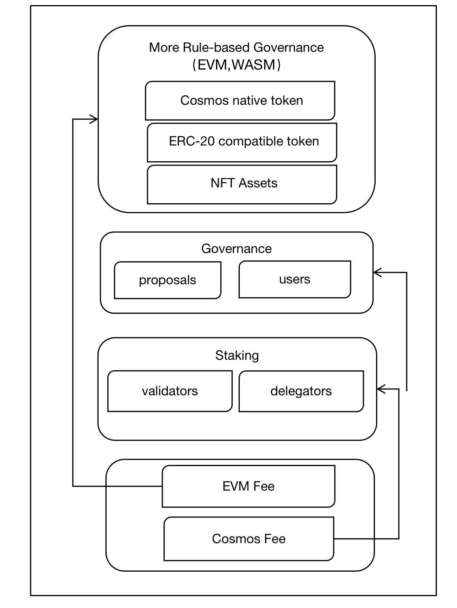
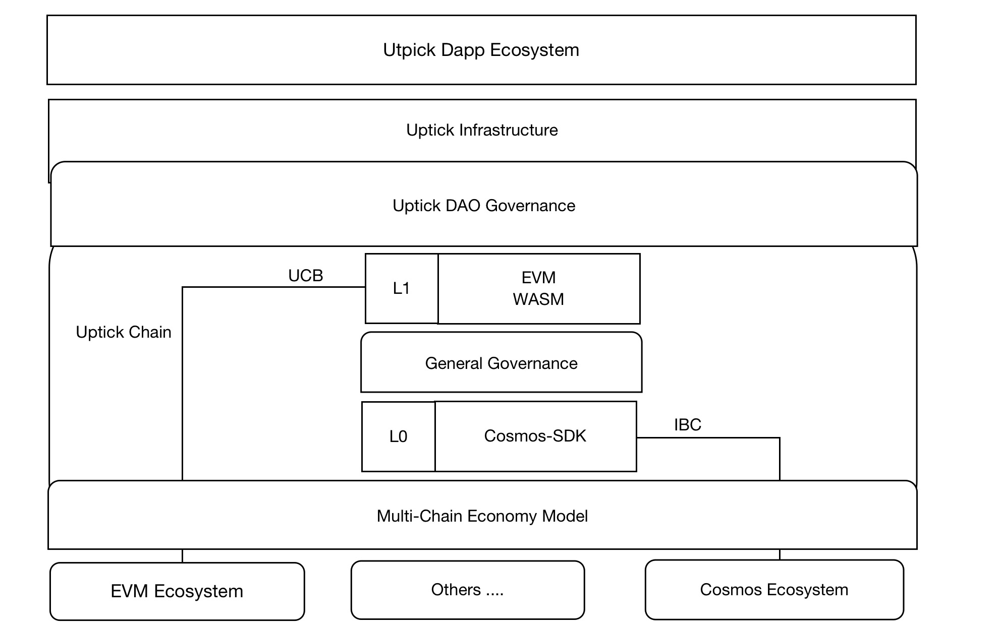
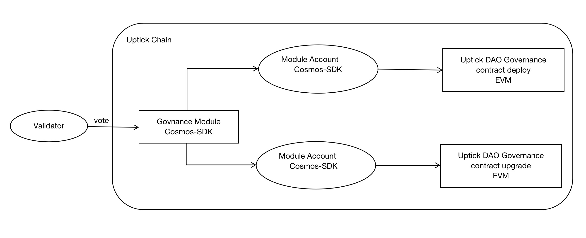
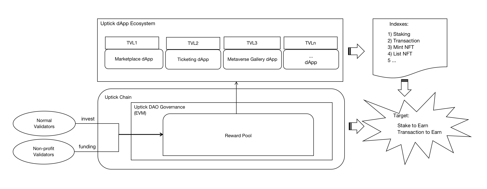

# Uptick Network 通证经济白皮书
- [Uptick Network 通证经济白皮书](#uptick-network-通证经济白皮书)
- [引言](#引言)
- [通证效用](#通证效用)
  - [手续费](#手续费)
    - [参数设置](#参数设置)
    - [手续费分配](#手续费分配)
  - [质押](#质押)
    - [计算公式](#计算公式)
    - [参数设置](#参数设置-1)
    - [质押奖励分配](#质押奖励分配)
  - [通用治理](#通用治理)
    - [治理功能](#治理功能)
    - [参数设置](#参数设置-2)
  - [扩展型基于规则的治理](#扩展型基于规则的治理)
- [通证供应](#通证供应)
- [初始通证分配](#初始通证分配)
- [通证经济学](#通证经济学)
  - [通用治理](#通用治理-1)
  - [Uptick DAO 治理（扩展型基于规则的治理）](#uptick-dao-治理扩展型基于规则的治理)
  - [多链经济模型](#多链经济模型)
  - [通胀控制](#通胀控制)
- [路线图与未来规划](#路线图与未来规划)
- [结论](#结论)

## 引言
Uptick Network 正在为非同质化代币（NFT）构建企业级的基础设施与生态系统。
该平台的设计聚焦于多链与跨链互操作性，包含三大核心组件：NFT 基础设施、NFT 交易市场以及 NFT 生态应用。

### Uptick 链
Uptick 链是基于 Cosmos-SDK 构建的区块链网络，是 Uptick 基础设施的核心基石。
它是专门为支持 NFT 的使用而设计的。

### IBC 与 EVM 支持
平台集成了对以太坊虚拟机（EVM）以及部分跨链通信（IBC）网络的支持。
致力于为各类实用且具有开创性的 NFT 相关场景提供必要的互操作工具与服务。

### 基础设施
Uptick 基础设施在 Uptick 链之上提供了一套先进的模块化商业协议。
这些协议由拥有丰富区块链行业经验的团队开发，旨在支持各类与商业相关的 NFT 功能与特性，其中部分包括：
- 可互操作的 ERC 与 CW 资产标准
- 通过 IBC 与 EVM 网络实现的跨链 NFT
- 面向 NFT 经济的去中心化金融（DeFi）协议
- 跨链 NFT 元数据标准
- 去中心化数据即服务

Uptick Network 基于 Cosmos-SDK 构建，并由 Tendermint 共识引擎提供安全保障。
它被归类为应用型区块链，针对更广泛的区块链生态系统中的特定应用与使用场景进行了优化。

此外，Uptick Network 在更广阔的 Cosmos 生态系统中作为一个独立的区块链专区运行。
它遵循 Cosmos 通用的通证效用与激励模型，同时也针对 NFT 相关基础设施、生态发展以及扩展的 DAO 治理增加了自身的创新支持。

如需了解 Uptick Network 技术与架构的更多细节，请参考技术白皮书。 [**Technical Whitepaper** ](
https://github.com/UptickNetwork/Uptick-KB/blob/main/Languages/WHITEPAPER_Technical_CN.md) 

## 通证效用
Uptick Network 的愿景是为商业世界中高质量 NFT 的创建与使用提供基础框架。这包括必要的底层区块链技术，以及各类其他工具，用以支撑多种不同的商业环境。

关于 Uptick Network 具体的通证经济模型，请参考通证经济学章节。

由 Uptick 链管理的通证并不局限于 Cosmos-SDK 支持的原生通证。它们还包括基于 ERC-20 的通证以及 NFT。Uptick Network 开发了一套费用模型，不仅与 Cosmos-SDK 兼容，同时也适配 EVM，为各类通证提供灵活性。

UPTICK 是 Uptick 链上使用的原生平台通证，其效用主要分为四大类：
- 手续费
- 质押
- 通用治理
- 扩展型基于规则的治理

Figure 1. Token Utility

### 手续费
Uptick Network 使用其原生 UPTICK 通证设定交易手续费，该费用作为验证者将交易打包进下一个区块的激励。每笔交易的平均手续费约为 0.001 UPTICK。

在 Uptick 链正式上线的节点中，基于 EVM 的费用（EVM 费用）与基于 Cosmos-SDK 的费用（Cosmos 费用）保持基本一致。

Uptick 通过 feemarket 模块计算 EVM 费用与 Cosmos 费用。

#### 计算公式

fee = (baseFee + priorityTip) * gasLimit

其中 baseFee 是每个 gas 单位的固定区块网络费用，priorityTip 是可选设置的每 gas 单位额外费用。请注意，基础费用与优先小费均为 gas 价格。若要提交符合 EIP-1559 的交易，签名者需要指定 gasFeeCap，即其愿意支付的每 gas 单位总费用上限。可选地，可以指定 priorityTip，该费用同时包含优先费用与每个 gas 单位的区块网络费用（即基础费用）。

Cosmos-SDK 对 gas 的术语定义与以太坊不同。以太坊中称为 gasLimit 的概念，在 Cosmos 中称为 gasWanted。在 Uptick 上你可能会同时遇到这两种术语，因为它在 SDK 之上构建了以太坊兼容层，例如在使用不同钱包时，Keplr 对应 Cosmos，MetaMask 对应以太坊。

#### 参数设置
| 键名 | 类型 | 初始值 | 说明 |
| --- | --- | --- | --- |
| NoBaseFee | bool | FALSE | 控制基础费用的调整 |
| BaseFeeChangeDenominator | uint32 | 7 | 限制区块之间基础费用的变动幅度 |
| ElasticityMultiplier | uint32 | 2 | 限制基础费用根据上一区块总 gas 使用量进行增减的阈值 |
| BaseFee | uint32 | 1000000000 | EIP-1559 区块的基础费用 |
| EnableHeight | uint32 | 0 | 启用费用调整的区块高度 |
| MinGasPrice | sdk.Dec | 0 | 交易被打包进区块所需支付的全局最低 gas 价格 |

#### 手续费分配
上述交易手续费除分配给权益证明（PoS）节点与质押账户外，还会以社区税的形式收取并进入社区池。
社区池中的部分资金将作为通证经济模型的一部分，用于参与社区激励，或直接销毁，作为控制通胀的手段之一。

更多细节请参考通证经济学章节。

### 质押
UPTICK 通证通过验证者与委托者系统接入 Uptick Network 的共识引擎。
UPTICK 通证持有者可以参与网络质押，并通过验证交易与保障网络安全获得奖励。

#### 计算公式

inflationRateChangePerYear = (1 - bondedRatio/GoalBonded) * InflationRateChange
inflationRateChange = inflationRateChangePerYear/BlocksPerYear
inflation = Inflation + inflationRateChange

#### 参数设置
| 键名 | 类型 | 初始值 |
| --- | --- | --- |
| UnbondingTime | string | "1814400s" |
| MaxValidators | uint16 | 137 |
| KeyMaxEntries | uint16 | 7 |
| HistoricalEntries | uint16 | 3 |
| BondDenom | string | "stake" |
| MinCommissionRate | string | "0.000000000000000000" |
| InflationRateChange | string (dec) | "0.40000000000000000" |
| InflationMax | string (dec) | "0.070000000000000000" |
| InflationMin | string (dec) | "0.100000000000000000" |
| GoalBonded | string (dec) | "0.50000000000000000" |
| BlocksPerYear | string (uint64) | "6311520" |

#### 质押奖励分配
面向非营利组织的质押，例如基金会与生态发展相关质押。

**普通用户质押**
用户可根据自身偏好，在质押期限到期（21 天）后选择继续质押或解锁。

**非营利机构质押（例如基金会与生态发展）**
基于治理投票结果，这些资金将进入扩展型基于规则的治理的激励池，用于激励 Uptick 去中心化应用（dApp）生态与多链经济。

**社区池分配**
一部分质押奖励（初始设定为 2%）将进入社区池。
该池将用于激励对 Uptick 生态做出贡献的项目，具体由社区投票决定。

此外，部分通证可能会被销毁，以控制通胀与通证流通量。

### 通用治理
治理的作用是管理 Uptick 生态，确保其可持续与健康发展。
通过治理机制，社区成员可以参与协议的制定与修改，以及网络上提案的投票。

治理的作用包括但不限于：
- 维护 Uptick 协议的完整性与稳定性
- 定义与修改协议参数与规则，例如通胀率、交易手续费、治理参数
- 投票分配与使用社区内资金，包括指定用于开发项目、慈善事业及其他社区举措的资金
- 投票支持或反对升级或变更提案，例如软件版本更新或新功能引入
- 鼓励社区成员积极参与社区治理，增强社区共识与参与度，推动 Uptick 生态发展

#### 治理功能
Uptick 的治理可通过社区投票执行，包括但不限于：
- 通过调整参数设置表格中的内容，控制原生 Uptick 通证的通胀率
- 通过投票销毁一部分通证
- 通过投票确定奖励金额并制定扩展型基于规则的治理的奖励规则

#### 参数设置
| 键名 | 类型 | 初始值 |
| --- | --- | --- |
| min_deposit | array (coins) | [{"denom":"auptick","amount":"100000000000000000000"}] |
| max_deposit_period | string (time s) | "172800s" |
| voting_period | string (time s) | "172800s" |
| quorum | string (dec) | "0.334000000000000000" |
| threshold | string (dec) | "0.500000000000000000" |
| veto | string (dec) | "0.334000000000000000" |

### 扩展型基于规则的治理
由于 Uptick Network 内置 EVM 模块，UPTICK 通证以两种格式存在于网络中：
- Cosmos 原生通证
- ERC-20 兼容通证

借助 EVM（后续还将支持 CosmWasm 及更多虚拟机），Uptick 链支持基于智能合约的通证管理方式。
因此，除 Cosmos-SDK 模块定义的默认方式外，还将有多种创新方式构建类 DAO 治理规则。

Uptick 链将逐步实现以下链上加密资产的社区化治理，而不仅限于平台通证：
- 原生平台通证：UPTICK
- IBC 转账通证
- 生态应用发行的 ERC-20 兼容通证
- 具备公允市场价值的 NFT 资产

请注意，UPTICK 通证的效用将进一步完善，以确保符合法律法规要求。

## 通证供应
UPTICK 通证初始发行量为 10 亿枚（1,000,000,000）。

由于权益证明（PoS）网络的特性，Uptick 链的年通胀率将根据质押率与销毁率的变化，在 4% 至 10% 之间动态波动。

UPTICK 通证设计为价值存储型通证，通过在 SDK 链与智能合约层面实施的锁仓机制，有效控制市场流通。

## 初始通证分配
初始分配结构旨在激励长期持有者与 Uptick Network 生态。

UPTICK 通证的分配计划如下：

**私募与顾问：15%**
从 Uptick Network 上线开始，设置为期一年的归属期，期间 UPTICK 通证按每日 1/365 的比例线性归属。
全部通证存放于归属账户中，持有者可使用未归属通证在 Uptick Network 上进行质押。

该措施旨在提升 Uptick Network 的安全性，同时允许 UPTICK 持有者获得区块奖励。

**核心团队：15%**
从 Uptick Network 上线开始，设置为期四年的归属期，团队每六个月解锁其 UPTICK 通证的 1/8。
全部通证由多签归属账户保管，持有者可使用未归属通证在 Uptick Network 上进行质押。

该措施旨在提升 Uptick Network 的安全性，同时允许团队获得区块奖励。

**基金会：20%**
预留用于支持基金会的运营。

**生态发展：47.5%**
- 与战略跨链合作伙伴进行价值交换
- 面向生态应用构建者与终端用户的绩效型激励（应用开发与运营挖矿）
- 优秀合作伙伴奖励
- NFT 质押与借贷激励
- 跨链去中心化金融挖矿
- 面向 Uptick DAO 参与者与活动的激励与奖励
- 其他用途

**空投：2.5%**
本次空投的目标是支持 Uptick Network 及其核心生态合作伙伴与用户的长期成功。
其覆盖范围包括但不限于以下类别：
- 媒体与市场推广贡献者
- 测试网验证者与治理贡献者（含测试网 1.0 与测试网 2.0）
- 测试网市场贡献者（含测试网 1.0 与测试网 2.0）
- Uptick 的 IRISnet 市场贡献者
- Uptick 的 Loopring 市场贡献者
- 符合特定条件的 Cosmos Hub ATOM 通证持有者
- 符合特定条件的 IRISnet Hub IRIS 通证持有者
- IRISnet 治理中支持 Uptick 相关提案的支持者
- 其他支持 Uptick 项目的平台、应用与社区

空投将分阶段发放，而非在创世启动日一次性全部发放。
此外，部分类别的空投将遵循归属计划。

## 通证经济学
区块链项目难以落地的痛点之一在于，许多公链的通证经济仅聚焦于链本身，只考虑零层或一层的经济模型，而忽视了通证经济对生态应用与跨链生态的支撑。

Uptick Network 基于上述问题设计了多层级通证经济体系，包括：
- Uptick 网络基础层
负责 UPTICK 通证的发行与流通。
该层级的通证经济设计旨在保障 UPTICK 通证的稳定与安全。

- Uptick 去中心化应用生态层
包括所有构建在 Uptick Network 之上的去中心化应用。
该层级的通证经济设计旨在激励开发者构建并贡献于 Uptick 去中心化应用生态。

- 多链经济层
不同区块链网络之间的跨链合作与交互。
该层级的通证经济设计旨在激励并促进跨链交易与合作。

- 社区层
Uptick Network 社区成员与利益相关方。
该层级的通证经济设计旨在激励社区参与与贡献，确保 Uptick Network 的可持续性与增长。

通过设计多层级通证经济，Uptick Network 旨在打造全面且可持续的生态系统，惠及所有利益相关方，包括用户、开发者、投资者及更广泛的区块链社区。

_下圖展示了 Uptick Network 多層代幣經濟體系的結構：_

Figure 2. Multi-Chain Economy Layer

多层级通证经济具备多项优势：
**完整性**
通证经济的多层架构兼顾各类商业场景，分配链、跨链、生态等各方利益。

**可扩展性**
Uptick DAO 治理与多链经济模型基于图灵完备的 EVM 合约，理论上可实现任意通证经济逻辑。

**安全性**
通用治理基于 Cosmos-SDK，该框架已通过 Cosmos 生态验证，保障通证经济模型的安全。
此外，Uptick DAO 治理与多链经济模型的安全性由底层 EVM 安全机制保障。
与去中心化金融应用不同，Uptick Network 经济模型合约的合约账户为 Cosmos 模块账户，可避免因私钥泄露导致的安全风险。

**去中心化**
经济模型规则与修改通过 Cosmos-SDK 治理模块执行，需多数质押者确认。
该去中心化方式确保决策不会被单一实体控制。

### 通用治理
尽管 Cosmos 生态中没有对零层与一层的明确定义，但 Cosmos-SDK 可被视为等效于零层。
Cosmos-SDK 是一套支持在 Cosmos 生态中构建中心枢纽与专区的框架。

它已被证明在实现去中心化治理方面安全且有效。
因此，Uptick Network 选择使用 Cosmos-SDK 保障其通证经济的安全性、有效性与去中心化治理。

**动态质押模型**
Uptick Network 采用动态质押模型，根据当前质押的 UPTICK 通证比例调整年通胀率。
质押通证越多，通胀率越低，有助于维持通证价值。

此外，部分交易手续费将被销毁，减少 UPTICK 总供应量，提升剩余通证的价值。

UPTICK 通证持有者可参与网络治理决策，例如对网络升级与参数变更提案进行投票。
这让用户在 Uptick Network 的发展与方向上拥有话语权。

### Uptick DAO 治理（扩展型基于规则的治理）
Uptick DAO 是一套在 Uptick 生态中使用 EVM 合约构建的基于规则的智能合约集合。尽管合约基于 EVM，但其规则（合约生成）与修改（合约升级）需要通过底层 Uptick 验证者投票验证。

该合约同时保障 EVM 合约强大的去中心化金融功能与 Cosmos 体系的去中心化管理模式。

Figure 3. Uptick DAO Governance 

Uptick DAO 治理将覆盖不同规则的多个类别，例如权限管理、企业级应用开发与运营、去中心化数据服务等。

以下是运营绩效型商业应用奖励治理示例。
该流程描述了基础设施层如何有效支撑生态应用层，并实现共赢结果：
- 基金会与生态发展资金的质押奖励将捐赠至生态应用奖励池（EARP）
- 任何验证者也可将部分佣金/奖励捐赠至生态应用奖励池，以支持生态应用
- 生态应用奖励池资金的分配基于绩效衡量指标，即一套生态应用奖励池规则

示例：
- 应用可参与生态应用奖励池的质押获利模式吸引用户。
通过获取利息奖励与应用内会员特权，鼓励用户在该应用通道质押通证。
- 该应用的总锁仓价值（TVL）越高，为 Uptick 生态带来的价值越大。
- 应用可参与生态应用奖励池的交易挖矿模式吸引用户。
该应用通道产生的交易将由基础设施上的数据分析器记录与分析。
- 应用可参与生态应用奖励池的 NFT 质押获利模式吸引用户。
NFT 的估值应获得市场的公允认可。

生态应用奖励池计划将新增更多规则。
其目的是为运营良好的商业生态应用提供有意义且可持续的资金。
应用可将此类资金传递给其用户。

最终，质押获利、交易挖矿等生态应用奖励池规则的成功执行，可通过交易手续费为质押者创造更多收益，真正实现共赢。

Figure 4. Example of Rewards Governance

### 多链经济模型
多链经济模型仍处于探索阶段，主要包含两个方面：

**跨链交易与质押**
- Uptick 链与 IBC 链之间
- Uptick 链与 EVM 链之间

**跨链基础设施服务提供商激励**
- IBC（跨链通信）跨链中继器
- UCB（Uptick 跨链桥）跨链桥
- 基于 Uptick 跨链协议的跨链数据分析工具

### 通胀控制
在权益证明（PoS）区块链中，通胀控制通过多种机制实现，例如调整区块奖励与通证供应量。
对于 Uptick Network，有多种方式控制通胀：

**区块奖励调整**
区块奖励是验证者每验证一个区块所获得的通证数量。
通过调整区块奖励，可以控制通胀率。
在 Uptick Network 中，区块奖励由通证总供应量与目标年通胀率决定。

**动态质押奖励**
Uptick Network 还支持动态质押奖励，根据质押通证数量调整奖励。
这意味着质押通证越多，奖励越低，反之亦然。
该机制旨在鼓励更多通证持有者质押通证，助力网络安全。

**社区驱动治理**
Uptick Network 基于社区驱动治理模型，通证持有者可提案并投票决定网络变更，包括通胀率调整。
通过社区驱动治理，可调整通胀率以反映社区的需求与意愿。

通过谨慎平衡这些机制，网络可长期维持稳定且可持续的通胀率。

## 路线图与未来规划
Uptick Network 的发展路线图随着行业发展持续演进。

以下是已确认、目标明确的规划：
- 支持 Wasm 合约
- 在基础设施中引入预言机
- 发布 Uptick Web3 接口
- 实施开发者计划
- 实现模块化商业逻辑协议
- 发布更多原生与跨链 NFT 资产标准
- 制定 Uptick DAO 治理规则
- 建立多链经济模型
- 其他规划

## 结论
Uptick Network 的通证经济模型包含多个层级，例如通用治理、Uptick DAO 治理以及多链经济模型。
这种组合模型比单纯基于链的模型更全面、更具可扩展性，各层级的通证经济既保障链级安全，又支撑企业级生态的健康成长。

此外，Uptick Network 计划推出长期绩效型开发者挖矿计划，旨在逐步扩展基础设施，支撑多元化的生态应用。
